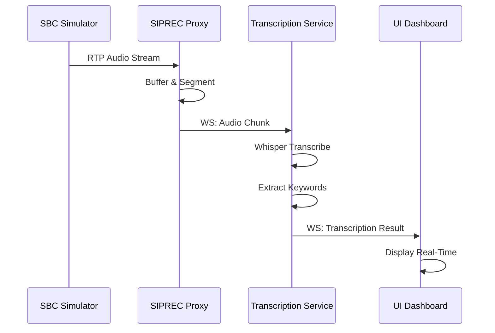

# TNT System Architecture

## Overview

The TNT (Transcribe and Tag) system is a microservices-based architecture designed for real-time transcription of emergency 911 calls with automatic keyword detection.

## System Components

```
┌─────────────────────────────────────────────────────────────────┐
│                         TNT System                              │
├─────────────────────────────────────────────────────────────────┤
│                                                                 │
│  ┌──────────┐      ┌──────────┐      ┌──────────────┐         │
│  │   SBC    │─RTP─→│  SIPREC  │─WS──→│Transcription │         │
│  │Simulator │      │  Proxy   │      │   Service    │         │
│  └──────────┘      └──────────┘      └──────────────┘         │
│                          │                    │                 │
│                          │                    │                 │
│                          ├────────WS──────────┤                 │
│                          │                    │                 │
│                          ▼                    ▼                 │
│                    ┌──────────────────────────────┐            │
│                    │       UI Dashboard           │            │
│                    │   (React + TypeScript)       │            │
│                    └──────────────────────────────┘            │
│                                                                 │
└─────────────────────────────────────────────────────────────────┘
```

## Data Flow

### 1. Audio Capture Flow

```
SBC Simulator → SIPREC Proxy → Transcription Service → UI Dashboard
```

**Detailed Steps:**

1. **SBC Simulator** generates or streams audio data
2. **SIPREC Proxy** receives RTP audio streams via SIPREC protocol
3. **SIPREC Proxy** buffers and segments audio into chunks
4. **SIPREC Proxy** sends audio chunks via WebSocket to Transcription Service
5. **Transcription Service** processes audio with Whisper AI
6. **Transcription Service** extracts keywords and metadata
7. **Transcription Service** broadcasts results via WebSocket to UI
8. **UI Dashboard** displays real-time transcriptions and keywords

### 2. Real-Time Transcription Flow



## Package Structure

### Core (@tnt/core)

**Purpose:** Shared types, interfaces, and utilities

**Key Components:**
- `types.ts` - TypeScript type definitions
- `constants.ts` - System-wide constants
- `utils.ts` - Shared utility functions

**Dependencies:** None (foundational package)

### Transcription (@tnt/transcription)

**Purpose:** Audio transcription and keyword extraction

**Key Components:**
- `TranscriptionService` - Main service class
- `WhisperAdapter` - Whisper AI integration
- `KeywordExtractor` - Emergency keyword detection
- `AudioProcessor` - Audio format conversion

**Technology:**
- **Whisper AI** (whisper-node) - OpenAI's speech recognition model
- **Base model** - ggml-base.bin (141MB)
- **Performance:** 300-600ms for 1-5s audio

**Port:** 3002

**API Endpoints:**
- `POST /api/transcribe` - Transcribe audio
- `GET /health` - Health check

### SIPREC Proxy (@tnt/siprec-proxy)

**Purpose:** SIPREC protocol handler and audio stream management

**Key Components:**
- `SIPRECServer` - SIPREC protocol server
- `RTPHandler` - RTP stream processing
- `AudioBuffer` - Audio segmentation and buffering
- `WebSocketRelay` - Real-time audio forwarding

**Technology:**
- **SIP.js** - SIPREC protocol handling
- **Node RTP** - RTP packet processing
- **WebSocket** - Real-time communication

**Port:** 5060 (SIP), 3001 (WebSocket)

### SBC Simulator (@tnt/sbc-simulator)

**Purpose:** Simulates Session Border Controller for testing

**Key Components:**
- `SBCSimulator` - Main simulator class
- `AudioGenerator` - Test audio generation
- `SIPRECClient` - SIPREC protocol client

**Technology:**
- **SIP.js** - SIPREC client
- **Node RTP** - RTP stream generation

**Port:** Configurable

### UI (@tnt/ui)

**Purpose:** React-based web dashboard for operators

**Key Components:**
- `CallMonitor` - Real-time call display
- `TranscriptionView` - Transcription timeline
- `KeywordHighlighter` - Keyword visualization
- `MetricsPanel` - Performance metrics

**Technology:**
- **React 18** - UI framework
- **TypeScript** - Type safety
- **WebSocket** - Real-time updates
- **Tailwind CSS** - Styling

**Port:** 5173 (dev), 3000 (prod)

## Communication Protocols

### SIPREC Protocol

**Purpose:** Industry-standard protocol for recording SIP sessions

**Flow:**
```
SBC → SIPREC INVITE → Recording Server
SBC → RTP Audio Stream → Recording Server
Recording Server → 200 OK → SBC
```

**Media Format:**
- Codec: G.711 μ-law (PCMU)
- Sample Rate: 8kHz
- Channels: Mono
- Container: RTP

### WebSocket Protocol

**Purpose:** Real-time bidirectional communication

**Messages:**

1. **Audio Chunk (Proxy → Transcription):**
```json
{
  "type": "audio_chunk",
  "data": {
    "callId": "uuid",
    "audio": "base64-encoded-data",
    "timestamp": 1234567890,
    "sequence": 0
  }
}
```

2. **Transcription Result (Transcription → UI):**
```json
{
  "type": "transcription_result",
  "data": {
    "callId": "uuid",
    "transcription": "Emergency at 123 Main Street",
    "keywords": [...],
    "metadata": {...}
  }
}
```

3. **Call Status (Proxy → UI):**
```json
{
  "type": "call_status",
  "data": {
    "callId": "uuid",
    "status": "active|ended",
    "duration": 30
  }
}
```

## Audio Processing Pipeline

### 1. Capture

```
SBC → RTP Packets → SIPREC Proxy Buffer
```

- Format: G.711 μ-law
- Sample Rate: 8kHz
- Packet Size: 160 bytes (20ms)

### 2. Buffering

```
RTP Buffer → Audio Chunks (1-5s segments)
```

- Chunk Duration: 1-5 seconds
- Buffer Strategy: Sliding window
- Overlap: 500ms (for context)

### 3. Conversion

```
G.711 μ-law → WAV PCM 16kHz Mono
```

- Target Format: WAV PCM
- Target Sample Rate: 16kHz (Whisper optimal)
- Target Channels: 1 (mono)

### 4. Transcription

```
WAV Audio → Whisper Base Model → Text
```

- Model: ggml-base.bin
- Language: Auto-detect or specified
- Performance: 300-600ms per 1-5s chunk

### 5. Keyword Extraction

```
Transcribed Text → Keyword Matcher → Tagged Keywords
```

- Categories: urgency, service_type, location, medical, crime
- Confidence Threshold: 0.6
- Position Tracking: Character offset

## Scalability Considerations

### Current Architecture (MVP)

- Single transcription service instance
- In-memory buffering
- No persistent storage
- WebSocket-only communication

### Production Enhancements

**Horizontal Scaling:**
```
Load Balancer → [Transcription Service 1]
              → [Transcription Service 2]
              → [Transcription Service N]
```

**Message Queue:**
```
SIPREC Proxy → Redis/RabbitMQ → Transcription Services
```

**Persistent Storage:**
```
Transcription Results → PostgreSQL/MongoDB
Audio Recordings → S3/Object Storage
```

**Caching:**
```
Redis → Keyword Cache
      → Model Cache
      → Session Cache
```

## Security Considerations

### Current (MVP)

- No authentication
- No encryption (local dev)
- No audit logging

### Production Requirements

**Authentication:**
- API keys for service-to-service
- JWT tokens for UI access
- Role-based access control

**Encryption:**
- TLS/SSL for all HTTP/WebSocket
- SRTP for media streams
- At-rest encryption for recordings

**Compliance:**
- CJIS compliance for 911 data
- HIPAA for medical information
- Data retention policies
- Audit logging

## Monitoring & Observability

### Metrics

**Service Metrics:**
- Transcription latency (p50, p95, p99)
- Keyword detection rate
- Error rate
- Throughput (calls/minute)

**System Metrics:**
- CPU usage
- Memory usage
- Network I/O
- Disk I/O

**Business Metrics:**
- Active calls
- Total transcriptions
- Language distribution
- Keyword frequency

### Logging

**Log Levels:**
- ERROR: Service failures
- WARN: Degraded performance
- INFO: Call lifecycle events
- DEBUG: Detailed processing info

**Structured Logging:**
```json
{
  "timestamp": "2024-01-01T12:00:00Z",
  "level": "INFO",
  "service": "transcription",
  "callId": "uuid",
  "event": "transcription_complete",
  "duration": 523,
  "language": "en"
}
```

## Technology Stack Summary

| Component | Technology | Version | Purpose |
|-----------|-----------|---------|---------|
| Transcription | Whisper (whisper-node) | 1.1.1 | Speech-to-text |
| SIPREC | SIP.js | Latest | SIP protocol |
| RTP | node-rtp | Latest | Media streaming |
| UI | React | 18 | User interface |
| Language | TypeScript | 5.x | Type safety |
| Build | Turbo | 2.x | Monorepo builds |
| Package Manager | pnpm | 9.x | Dependency management |
| Runtime | Node.js | 20.x | Server runtime |

## Development Workflow

### Local Development

```bash
# Install dependencies
pnpm install

# Start all services
pnpm dev

# Run tests
pnpm test

# Build for production
pnpm build
```

### Service Ports

| Service | Port | Protocol |
|---------|------|----------|
| SIPREC Proxy | 5060 | SIP/UDP |
| SIPREC Proxy WS | 3001 | WebSocket |
| Transcription | 3002 | HTTP/WS |
| UI Dev Server | 5173 | HTTP |
| UI Production | 3000 | HTTP |

## Future Enhancements

1. **Multi-channel audio** support (caller + callee separation)
2. **Speaker diarization** (identify different speakers)
3. **Real-time sentiment analysis**
4. **Integration with CAD systems**
5. **Mobile operator app**
6. **Advanced analytics dashboard**
7. **ML-based keyword learning**
8. **Voice biometric identification**
